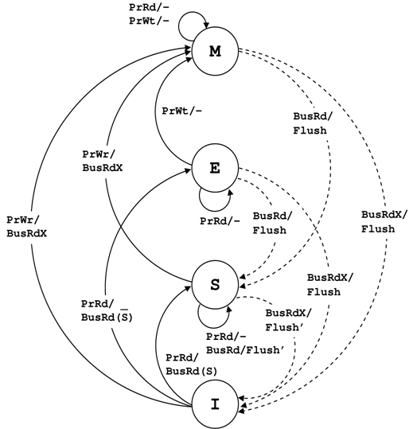

## What is CPU Cache?
---
CPU 내부에 있는 SRAM을 말한다. 메인 메모리(DRAM)는 CPU 연산 속도에 비해 너무 느리기 때문에 병목 현상이 발생한다. 이 병목을 완화하기 위해 CPU와 메인 메모리 사이에 SRAM이라는 작고 빠른 캐시를 두게 되었다.

### Locality of Reference
캐시는 지역성의 원리를 이용해 동작한다.
* **Temporal Locality:** 최근에 사용된 데이터는 가까운 미래에 재사용될 가능성이 높다.
* **Spatial Locality:** 접근한 데이터의 근처 데이터는 가까운 미래에 사용될 가능성이 높다.

### Cache Line
메인 메모리에서 캐시로 데이터를 가져올 때, 공간 지역성을 활용하기 위해 접근한 데이터 단위가 아닌 더 큰 단위로 가져온다. 이를 캐시라인이라 하며 대부분의 시스템에서 64B 크기를 갖는다. 캐시라인은 캐시가 데이터를 관리하는 최소 단위이다.

### Cache Hierarchy
현대 시스템은 더 빠른 성능을 위해 여러 단계의 캐시 계층을 갖는다. (L1, L2, L3 캐시) CPU 코어와 가까울수록 속도가 빠르고 용량이 작다.

## Cache Performance Metrics
---
캐시의 성능을 정량적으로 평가하기 위해 몇 가지 메트릭이 사용된다.

### Average Memory Access Time (AMAT)
AMAT는 메모리 접근에 걸리는 평균 시간을 나타낸다.

$$\text{AMAT} = \text{HT} + (\text{MR} \times \text{MP})$$

* **HT (Hit Time):** 캐시 히트 시 데이터를 가져오는 데 걸리는 시간
* **MR (Miss Rate):** 캐시 미스가 발생하는 비율
* **MP (Miss Penalty):** 캐시 미스 시 메인 메모리에서 데이터를 가져오는 데 걸리는 추가 시간

현대 시스템은 L1, L2, L3의 다단계 캐시 계층을 사용하며, AMAT는 재귀적으로 계산된다.

$$\text{AMAT} = \text{HT}_{L1} + \text{MR}_{L1} \times (\text{HT}_{L2} + \text{MR}_{L2} \times (\text{HT}_{L3} + \text{MR}_{L3} \times \text{MP}_{\text{Mem}}))$$

### CPU Execution Time
캐시 성능은 전체 CPU 실행 시간에 직접적인 영향을 미친다.

$$\text{CPU Time} = (\text{CPU Exec Cycles} + \text{Memory Stall Cycles}) \times \text{Cycle Time}$$

* **CPU Exec Cycles:** 실제 연산을 수행하는 데 걸리는 사이클 수
* **Memory Stall Cycles:** 메모리 접근 대기로 인해 파이프라인이 멈춰 있는 사이클 수
* **Cycle Time:** 클럭 주기

Memory Stall Cycles는 캐시 미스에 의해 발생하며 다음과 같이 계산된다.

$$\text{Memory Stall Cycles} = \text{Instructions} \times \frac{\text{Misses}}{\text{Instruction}} \times \text{Miss Penalty}$$

CPU 코어가 아무리 빨라도 캐시 미스로 인해 파이프라인이 스톨되면 전체 성능이 크게 저하된다. 현대 슈퍼스칼라 프로세서는 비순차 실행을 통해 메모리 대기 중에도 다른 명령어를 실행하여 스톨을 완화하지만, 근본적인 해결책은 캐시 미스 자체를 줄이는 것이다.

## Mapping Strategies
---
메모리 주소는 Tag, Index, Offset 세 부분으로 나뉘며, 이를 통해 데이터가 어느 캐시라인에 있는지 찾는다. 각 캐시라인에는 데이터 외에도 태그 값과 Valid bit 등의 메타데이터가 저장된다.

### 1. Direct Mapped Cache
데이터가 들어갈 캐시라인이 딱 하나로 정해진다. 
* **Characteristics:** 탐색할 필요가 없어 빠르지만, 위치가 고정되어 있어 동일한 인덱스를 갖는 메모리 주소들이 부딪히는 충돌 미스가 잦다.
* **Bit Calculation:**
    * **Index:** $\log_2(\text{Cache Lines})$
    * **Offset:** $\log_2(\text{Cache Line Size})$
    * **Tag:** $\text{Address Bits} - (\text{Index} + \text{Offset})$

### 2. Fully Associative Cache
데이터가 캐시 내의 어떤 라인에든 들어갈 수 있다.
* **Characteristics:** 충돌이 거의 없어 히트율이 높다. 하지만 원하는 데이터를 찾으려면 모든 캐시라인의 태그를 병렬적으로 탐색해야 하므로 캐시라인 개수만큼의 Comparator가 필요하다. 전력 소모가 크고 회로가 복잡하다.
* **Bit Calculation:**
    * **Index:** $0 \text{ bits}$
    * **Offset:** $\log_2(\text{Cache Line Size})$
    * **Tag:** $\text{Address Bits} - \text{Offset}$

### 3. Set Associative Cache
직접 사상과 완전 연관 사상의 트레이드오프 방식이다.
* **Characteristics:** 전체 캐시는 세트 단위로 나뉜다. 특정 주소는 정해진 세트에만 들어갈 수 있지만, 세트 내의 여러 라인 중 하나를 자유롭게 선택할 수 있다. 직접 사상보다 충돌이 적고 완전 연관 사상보다 하드웨어 비용이 적다. 현대 CPU 캐시의 표준 방식이다.
* **Bit Calculation:**
    * **Index:** $\log_2(\text{Cache Sets})$
    * **Offset:** $\log_2(\text{Cache Line Size})$
    * **Tag:** $\text{Address Bits} - (\text{Index} + \text{Offset})$


## Cache Addressing
---
캐시 접근 시 가상 주소와 물리 주소 중 어떤 것을 사용하느냐에 따라 세 가지 방식으로 나뉜다.

### PIPT (Physically Indexed, Physically Tagged)
인덱스와 태그 모두 물리 주소를 사용하는 방식이다. TLB가 주소 변환을 완료해야만 캐시에 접근할 수 있으므로, 주소 변환과 캐시 접근이 순차적으로 진행되어 레이턴시가 길다. 하지만 구조가 단순하고 캐시 크기 제약이 없어 L2, L3 캐시에서 주로 사용한다.

### VIPT (Virtually Indexed, Physically Tagged)
인덱스는 가상 주소를 사용하고, 태그는 물리 주소를 사용하는 방식이다. 주소 변환과 캐시 세트 접근을 병렬적으로 처리할 수 있어 PIPT보다 빠르다.

#### Mechanism
1. 가상 주소의 인덱스 비트로 캐시 세트에 접근 (TLB와 병렬 수행)
2. TLB가 물리 주소로 변환 완료
3. 물리 주소의 태그 비트와 캐시라인의 태그를 비교

#### Synonym Problem
VIPT의 핵심 제약은 인덱스 비트가 페이지 오프셋 범위 내에 있어야 한다는 점이다. 가상 주소와 물리 주소는 페이지 오프셋 부분이 동일하므로, 이 범위 내에서만 인덱스를 추출하면 가상/물리 주소 간 일관성이 보장된다.

페이지 크기가 4KB이고 캐시라인이 64B라면, 인덱스로 사용할 수 있는 비트는 최대 6비트다. 즉, 캐시 세트는 최대 $2^6 = 64$개까지만 가능하다. 캐시 용량을 늘리려면 세트 수를 늘릴 수 없으므로 associativity(way 수)를 늘려야 한다.

만약 인덱스 비트가 페이지 오프셋을 넘어간다면 synonym 문제가 발생한다. 서로 다른 가상 주소가 동일한 물리 주소를 가리킬 때, 인덱스 비트가 다르면 동일한 데이터가 캐시의 서로 다른 세트에 중복 저장되어 데이터 불일치가 발생한다.

따라서 하드웨어 설계자는 다음 조건을 만족하도록 캐시를 설계한다.

$$\text{Way Size} = \frac{\text{Total Cache Size}}{\text{Associativity}} \le \text{Page Size}$$

예를 들어 32KB 캐시를 4KB 페이지에 맞추려면 최소 8-way associative여야 한다.

VIPT는 속도가 중요한 L1 캐시에 주로 사용되며, 용량이 더 중요한 L2/L3 캐시는 PIPT를 사용한다.

### VIVT (Virtually Indexed, Virtually Tagged)
인덱스와 태그 모두 가상 주소를 사용한다. 주소 변환이 필요 없어 가장 빠르지만, 치명적인 문제가 있다.

각 프로세스는 독립적인 가상 주소 공간을 가지는데, 태그도 가상 주소이므로 어떤 프로세스의 데이터인지 구분할 수 없다. 프로세스 A가 가상 주소 0x1000에 쓴 값을 프로세스 B가 자신의 0x1000에서 읽을 수 있게 된다.

이를 방지하려면 context switch마다 캐시를 전체 flush해야 하므로, 성능 이득이 완전히 사라진다. 따라서 VIVT는 현대 CPU에서 거의 사용되지 않는다.

## Cache Inclusion Policy
---
캐시 계층 간 데이터 중복 저장 정책을 결정한다.

* **Inclusive Cache:** L3가 L1/L2의 모든 데이터를 포함한다. L3만 확인하면 데이터의 존재 여부를 파악할 수 있지만, L3 공간이 중복 데이터로 낭비된다. (Intel의 전통적 방식)
* **Exclusive Cache:** 각 레벨이 서로 다른 데이터만 저장한다. 전체 유효 캐시 용량이 늘어나지만, 데이터 위치 추적을 위한 디렉토리가 필요하다. (AMD의 방식)
* **Non-Inclusive Non-Exclusive (NINE):** L3가 L1/L2 데이터를 포함할 수도, 아닐 수도 있다. Inclusive보다 공간 효율적이고 Exclusive보다 유연하지만 디렉토리 관리가 필요하다. (최근 Intel의 방식)


## Replacement Policy
---
캐시 세트가 가득 찼을 때 어떤 라인을 비울지 결정하는 알고리즘이다.
* **LRU (Least Recently Used):** 가장 오랫동안 사용되지 않은 라인을 교체한다. 시간 지역성 원리에 가장 부합하지만 구현 비용이 크다.
* **Pseudo-LRU:** LRU의 효율적인 근사 알고리즘이다. 주로 이진 트리 구조로 구현한다.
* **Random:** 무작위로 교체한다. 상태 저장 비트나 갱신 로직이 필요 없어 전력 소모와 회로 면적을 최소화할 수 있다.


## Write Policy
---
캐시에 쓰기 연산이 발생했을 때 메인 메모리와의 동기화 시점 및 방법을 결정한다.

### Write-Hit Policy
쓰기 히트 시 메인 메모리에 반영하는 시점을 결정한다.

* **Write-through:** 캐시와 메모리를 동시에 업데이트한다. 데이터 일관성이 보장되나 메모리 쓰기가 빈번해 성능이 느리다.
* **Write-back:** 캐시만 먼저 수정하고 Dirty bit를 설정한 뒤, 해당 라인이 교체될 때 메모리에 기록한다. 쓰기 성능이 우수하지만 멀티코어 환경에서 코어 간 데이터 불일치 문제를 야기하므로 별도의 일관성 프로토콜이 필요하다.

### Write-Miss Policy
쓰기 미스 시 처리 방법을 결정한다.

* **Write-Allocate:** 먼저 메모리에서 데이터를 캐시로 가져온 뒤 캐시에 쓴다. 이후 같은 주소에 대한 접근이 캐시 히트가 되므로 locality가 높은 경우 유리하다. 주로 Write-back과 함께 사용한다.
* **Write-Around (No-Write-Allocate):** 캐시를 거치지 않고 메인 메모리에 직접 쓴다. 한 번만 쓰고 다시 접근하지 않는 데이터에 유리하며, 불필요한 캐시 오염을 방지한다. 주로 Write-through와 함께 사용한다.


## Cache Coherence
---
현대 시스템은 성능을 위해 Write-back 쓰기 정책을 주로 사용한다. 이 방식은 캐시의 데이터가 수정되어도 즉시 메모리에 반영하지 않으므로, 특정 시점에 캐시와 메모리의 데이터가 서로 다를 수 있다.

멀티 코어 환경에서는 각 코어가 자신만의 L1, L2 캐시를 가진다. 만약 코어 A가 데이터를 수정했는데 코어 B가 메모리나 자신의 캐시에서 옛날 데이터를 읽어간다면 데이터 불일치 문제가 발생한다. 이를 방지하기 위해 각 코어의 캐시라인을 동기화하는 일관성 메커니즘이 필요하다.

### Hardware Approaches
캐시 일관성을 유지하기 위한 하드웨어적 설계 방식은 크게 두 가지로 나뉜다.

#### 1. Snooping
모든 코어가 하나의 공유 버스에 연결되어 있는 구조다.
* **Mechanism:** 각 코어의 캐시 컨트롤러는 버스를 항상 감시한다. 다른 코어가 데이터를 요청하거나 상태를 변경하는 메시지를 버스에 던지면(Broadcast), 이를 가로채서 자신의 캐시 상태를 업데이트한다. 
* **Trade-off:** 설계가 비교적 간단하지만, 코어 수가 많아지면 버스에 트래픽이 몰려 성능이 급격히 저하된다. 즉, 확장성이 떨어진다.

#### 2. Directory-based
캐시 라인의 상태 정보를 별도의 중앙 관리자(Directory)에 기록하는 방식이다.
* **Mechanism:** 데이터를 변경하거나 요청하려는 코어는 먼저 디렉토리에 알린다. 디렉토리는 해당 데이터를 공유하고 있는 코어들에게만 핀포인트로 메시지를 보낸다(Unicast/Multicast). 
* **Trade-off**
    * **Pros:** 불필요한 브로드캐스트가 없어 코어가 수백 개 이상인 대규모 시스템에서도 잘 작동한다.
    * **Cons:** 디렉토리 정보를 저장할 별도의 메모리가 필요하고, 매번 관리자를 거쳐야 하므로 통신 단계가 많아져 레이턴시가 발생한다.


## MESI Protocol
---
스누핑 기반 시스템에서 가장 널리 쓰이는 일관성 프로토콜이다. 캐시라인의 상태를 4가지로 정의한다.

* **M (Modified):** 데이터가 수정된 상태. 나만 들고 있으며 메인 메모리와 데이터가 다르다.
* **E (Exclusive):** 나만 들고 있는 상태. 메인 메모리와 데이터가 일치한다. 이 상태에서는 버스 트랜잭션 없이 즉시 데이터를 수정할 수 있다.
* **S (Shared):** 다른 코어도 복사본을 들고 있는 상태. 메인 메모리와 데이터가 일치한다.
* **I (Invalid):** 유효하지 않은 데이터.


_State diagram for MESI protocol_

### Bus Transactions
MESI 상태 전이를 유도하는 주요 버스 트랜잭션은 다음과 같다.

* **BusRd:** 읽기 미스 시 발생하는 신호. M 또는 E 상태인 코어가 있다면 FlushOpt로 캐시라인을 제공하고 S로 전이한다. M 상태였다면 메인 메모리도 함께 업데이트된다. S 상태인 코어들도 응답할 수 있지만 여러 개일 경우 누가 응답할지 결정해야 한다. 유효한 캐시라인이 없다면 메인 메모리에서 가져오며 E 상태가 된다.
* **BusRdX:** 쓰기 미스 시 발생하는 신호. BusRd와 동일하게 캐시라인을 가져오되, 캐시라인을 받음과 동시에 다른 모든 코어의 캐시라인을 무효화(I)하므로 요청자는 즉시 M 상태가 된다. RFO(Read For Ownership)라고도 한다.
* **BusUpgr:** 이미 캐시라인을 가지고 있지만 S 상태여서 수정 권한이 없을 때 발생하는 신호. 캐시라인 전송 없이 다른 코어들의 캐시만 무효화(I)시키고 자신은 M 상태로 전이한다.
* **Flush:** 변경된 캐시라인을 메인 메모리에 기록하는 동작이다.
* **FlushOpt:** 변경된 캐시라인을 버스에 실어 요청한 코어에게 Cache-to-Cache 하는 동작이다.

### Variants in Commercial Processors
실제 상용 프로세서는 MESI를 개선한 프로토콜을 사용한다.

* **MOESI (AMD):** O (Owned) 상태를 추가. Dirty 데이터를 공유할 수 있게 하여, 수정된 데이터를 메모리에 쓰지 않고도 다른 코어에게 직접 전달할 수 있다. O 상태인 코어가 교체될 때만 메인 메모리에 업데이트하면 된다.
* **MESIF (Intel):** F (Forward) 상태를 추가. S 상태인 코어가 여러 개일 때, 누가 데이터를 응답할지 책임자(Forwarder)를 지정하여 버스 트래픽 중복을 막는다. 데이터를 전달받은 코어가 새로운 F가 되므로, 항상 가장 최근에 접근한 코어(빠른 캐시에 있을 확률이 높은)가 전달하게 된다.


## Cache Miss Types
---
캐시 미스는 발생 원인에 따라 세 가지 유형으로 분류된다. 각 미스 타입은 서로 다른 최적화 전략을 요구한다.

### 1. Compulsory Miss (Cold Miss)
프로그램이 시작된 후 처음 접근하는 데이터는 캐시에 존재하지 않으므로 반드시 미스가 발생한다. 이를 강제 미스 또는 콜드 미스라 한다.

#### Hardware Prefetching
현대 CPU는 메모리 접근 패턴을 학습하여 자동으로 프리페칭을 수행한다. 특히 배열을 순차적으로 접근하거나 일정한 간격으로 접근하는 패턴이 감지되면, CPU는 다음에 필요할 데이터를 미리 캐시로 가져온다. 따라서 배열 순회 시 순차 접근을 사용하면 하드웨어 프리페처의 도움을 받아 강제 미스를 크게 줄일 수 있다.

#### Software Prefetching
소프트웨어적으로도 명시적 프리페칭을 지시할 수 있다. GCC/Clang에서는 `__builtin_prefetch()` 함수를 제공한다.
```c
// 다음 반복에서 사용할 데이터를 미리 캐시로 가져온다
for (int i = 0; i < n; i++) {
    if (i + 8 < n) {
        __builtin_prefetch(&arr[i + 8], 0, 3);  // 8칸 앞의 데이터를 읽기용으로 프리페치
    }
    process(arr[i]);
}
```

단, 프리페칭은 힌트일 뿐이며 CPU가 무시할 수도 있다. 또한 잘못된 프리페칭은 유용한 데이터를 캐시에서 밀어내거나, 당장 필요한 데이터보다 미래에 쓰일 데이터를 먼저 가져오느라 메모리 대역폭을 낭비하여 현재 필요한 데이터의 접근을 지연시킬 수 있으므로 신중하게 사용해야 한다.

### 2. Capacity Miss
프로세스의 작업 집합이 캐시 용량보다 클 때 발생하는 미스다. 데이터가 한 번 참조된 후 다시 참조되기까지의 간격이 캐시 용량을 초과하면, 그 사이에 다른 데이터들이 캐시를 가득 채워 기존 데이터가 교체된다. 결과적으로 재참조 시 캐시에 데이터가 없어 미스가 발생한다.

#### Loop Tiling (Cache Blocking)
큰 배열을 작은 타일(블록) 단위로 나누어 처리하면 각 타일이 캐시에 적재된 상태를 유지할 수 있다.
```c
// 최적화 전: 캐시 용량 초과로 인한 반복적 미스
for (int i = 0; i < N; i++) {
    for (int j = 0; j < N; j++) {
        C[i][j] = 0;
        for (int k = 0; k < N; k++) {
            C[i][j] += A[i][k] * B[k][j];
        }
    }
}

// 최적화 후: 타일 단위로 처리하여 캐시 지역성 향상
#define TILE_SIZE 64
for (int i = 0; i < N; i += TILE_SIZE) {
    for (int j = 0; j < N; j += TILE_SIZE) {
        for (int k = 0; k < N; k += TILE_SIZE) {
            // 타일 내부 연산 - 데이터가 캐시에 머무름
            for (int ii = i; ii < min(i + TILE_SIZE, N); ii++) {
                for (int jj = j; jj < min(j + TILE_SIZE, N); jj++) {
                    for (int kk = k; kk < min(k + TILE_SIZE, N); kk++) {
                        C[ii][jj] += A[ii][kk] * B[kk][jj];
                    }
                }
            }
        }
    }
}
```

#### Mathematical Analysis

**Assumptions**
* Naive: 행렬 크기 $N$이 캐시보다 커서 재참조 시 데이터가 이미 축출되었다고 가정한다.
* Tiled: 타일 크기 $T$는 캐시보다 작아서 타일 내 연산 동안 데이터가 캐시에 유지된다고 가정한다.

**Naive Approach**

A 행렬(`A[i][k]`):
* `j` 루프가 돌 때마다 동일한 행을 $N$번 반복해서 읽는다.
* 행렬이 크면 캐시에서 밀려나 매번 RAM에서 가져온다.
* 트래픽: $N^3$

B 행렬(`B[k][j]`):
* `stride = N`으로 점프하며 읽어 공간 지역성이 최악이다.
* 캐시 라인당 1개만 사용하고 나머지는 버려진다.
* `C[i][j]` 하나를 계산할 때마다 `B`의 한 열($N$개)을 모두 읽는다.
* 트래픽: $N^3$

$$\text{Total Traffic} \approx 2N^3$$

**Tiled Approach**

타일 크기 $T \times T$, 총 $(N/T)^3$개의 블록 작업 수행. 블록 작업 1회당 타일 A, B를 로드하며($2T^2$), 캐시 안에서 $2T^3$번 연산을 수행한다.

$$\text{Total Traffic} = \left(\frac{N}{T}\right)^3 \times 2T^2 = \frac{2N^3}{T}$$

**Improvement Ratio**

$$\frac{2N^3 / T}{2N^3} = \frac{1}{T}$$

타일링을 적용하면 메모리 트래픽이 $1/T$배로 감소한다.


### 3. Conflict Miss
캐시 용량이 충분함에도 불구하고 서로 다른 데이터들이 동일한 캐시 세트에 매핑되어 충돌하면서 발생하는 미스다. 직접 사상이나 세트 연관 사상 방식에서 나타난다.

#### Critical Stride
배열의 stride가 Way Size의 배수일 경우 특히 치명적이다. 이 경우 데이터들의 인덱스 비트가 모두 동일해지므로, 해당 세트의 Way 개수를 초과하는 서로 다른 데이터들이 단 하나의 세트를 두고 경쟁하게 되어 캐시 히트율이 급격히 떨어진다.

#### Array Padding
배열에 패딩을 추가하여 충돌을 회피할 수 있다. 메모리 낭비를 최소화하는 최적의 패딩 크기는 다음과 같다.

$$\text{Padding Bytes} = \frac{\text{Cache Line Size}}{\text{Associativity}}$$

```c
// 충돌 미스 발생: 1024 * 8B = 8192B = 8KB (4KB Way Size의 배수)
double matrix[1024][1024];

// 패딩 추가: 1025 * 8B = 8200B
// 64B Line / 8-Way = 8 Bytes (double 1개) 패딩이 최적
double matrix[1024][1025];
```

패딩은 약간의 메모리를 소비하지만, 충돌 미스로 인한 성능 저하를 피할 수 있어 전체적으로 이득이다.

## Store Buffer
---
CPU와 L1 캐시 사이에 Store Buffer라는 버퍼가 존재한다. 메모리 쓰기 연산 시 캐시라인에 직접 쓰는 대신 이 버퍼에 먼저 기록한다. 메모리 읽기 연산 시에는 Store Buffer를 먼저 스캔하여 해당 주소에 대한 최신 값이 있으면 버퍼에서 가져온다.

### Motivation
캐시라인에 직접 쓰기를 시도하면 파이프라인 스톨이 발생한다. 특히 쓰려는 데이터가 캐시에 없거나 공유(S) 상태일 때 문제가 심각하다.

**Store Buffer 없을 때:**
1. CPU가 메모리 쓰기 명령 실행
2. 캐시 미스 또는 S 상태 → BusRdX/BusUpgr 트랜잭션 발생
3. 트랜잭션 완료까지 수백 사이클 동안 파이프라인 스톨
4. 완료 후에야 다음 명령 실행

Store Buffer를 사용하면 CPU는 버퍼에 쓰고 즉시 다음 명령을 실행할 수 있다. 버퍼의 데이터는 백그라운드에서 비동기적으로 캐시에 반영된다. 

### Memory Ordering Issues
Store Buffer로 인해 멀티코어 환경에서 메모리 순서 재배치 문제가 발생할 수 있다.
```c
// 초기 상태: x = 0, y = 0

// Core 0
x = 1;
r1 = y;

// Core 1  
y = 1;
r2 = x;

// 결과: r1 == 0 && r2 == 0 가능!
```

두 코어가 각각 쓰기 후 읽기를 수행한다. 각 코어는 자신의 Store를 Store Buffer에 넣고 즉시 다음 Load를 실행한다. 이때 상대방의 Store가 아직 메모리에 반영되지 않았을 수 있으므로, 양쪽 모두 이전 값을 읽을 가능성이 있다. 

이러한 문제를 방지하기 위해 메모리 배리어가 필요하다. 배리어를 만나면 CPU는 Store Buffer의 모든 항목이 캐시에 반영될 때까지 파이프라인을 스톨시킨다.

```c
// 초기 상태: x = 0, y = 0

// Core 0
x = 1;
__asm__ volatile("mfence" ::: "memory");
r1 = y;

// Core 1
y = 1;
__asm__ volatile("mfence" ::: "memory");
r2 = x;

// 이제 r1 == 0 && r2 == 0 불가능
```


## Invalidate Queue
---
각 코어의 캐시 컨트롤러에 Invalidate Queue라는 작은 버퍼가 존재한다. 다른 코어로부터 무효화 메시지를 받으면 즉시 처리하는 대신 이 큐에 먼저 넣는다.

### Motivation
일관성 프로토콜에서 무효화 메시지를 보낸 코어는 상대방이 실제로 무효화를 완료하고 확인 응답을 보낼 때까지 기다려야 하므로 파이프라인 스톨이 발생한다.

**Invalidate Queue 없을 때:**
1. Core A가 데이터를 수정하며 무효화 메시지 브로드캐스트
2. Core B가 무효화 메시지를 받고 캐시라인 무효화 처리
3. 무효화 완료 후 Core B가 확인 응답 전송
4. Core A는 응답을 받을 때까지 파이프라인 스톨

Invalidate Queue를 사용하면 메시지를 받은 코어는 큐에 넣고 즉시 확인 응답을 보낸다. 메시지를 보낸 코어는 곧바로 다음 작업을 진행할 수 있으며, 실제 무효화는 백그라운드에서 비동기적으로 처리된다. Store Buffer와 달리 Invalidate Queue는 스캔할 수 없다.

### Memory Visibility Issues
Invalidate Queue로 인해 멀티코어 환경에서 메모리 가시성 문제가 발생할 수 있다.
```c
// 초기 상태: x = 0, flag = 0

// Core 0
x = 1;
flag = 1;

// Core 1  
while (flag == 0);  // flag가 1이 될 때까지 대기
r1 = x;

// 결과: r1 == 0 가능!
```

Core 0이 `x = 1`을 쓰고 `flag = 1`을 설정한다. Core 1은 flag가 1이 되면 x를 읽는다. Core 0이 `x = 1`을 쓸 때 Core 1에 무효화 메시지를 보내면, Core 1은 메시지를 Invalidate Queue에 넣고 즉시 확인 응답을 보낸다. 이후 Core 1이 `flag == 1`을 확인하고 `r1 = x`를 실행할 때, 아직 큐의 무효화가 처리되지 않았다면 자신의 캐시에 있는 옛날 값 `x = 0`을 읽게 된다.

읽기 배리어를 만나면 CPU는 Invalidate Queue의 모든 항목이 실제로 처리될 때까지 파이프라인을 스톨시킨다.

```c
// 초기 상태: x = 0, flag = 0

// Core 0
x = 1;
__asm__ volatile("dmb ishst" ::: "memory");
flag = 1;

// Core 1
while (flag == 0);
__asm__ volatile("dmb ishld" ::: "memory");
r1 = x;

// 이제 r1 == 0 불가능
```

## False Sharing
---
멀티 스레드 프로그램에서 서로 다른 두 변수가 우연히 같은 캐시라인에 배치되어 성능이 저하되는 현상이다.

### Causes
두 스레드가 각각 독립적인 변수 A와 B를 수정한다고 가정한다. 두 변수가 같은 캐시라인에 묶여 있다면, MESI 프로토콜에 의해 Cache Ping-pong이라 불리는 다음과 같은 비효율이 발생한다.

1. 스레드 1이 변수 A를 수정하면 캐시라인이 M 상태가 된다.
2. 이때 스레드 2가 변수 B를 수정하려면, 스레드 1의 캐시라인을 무효화하고 데이터를 가져와야 한다.
3. 스레드 1이 다시 A를 쓰려면 또 스레드 2의 캐시를 무효화해야 한다.

실제로는 데이터가 충돌하지 않음에도 불구하고, 캐시라인 단위로 일관성을 관리하기 때문에 마치 하나의 데이터를 두고 싸우는 것처럼 불필요한 트래픽 발생과 메모리 쓰기가 반복된다. 

### Solutions
두 변수가 서로 다른 캐시라인에 놓이도록 강제한다. GCC/Clang 환경에서는 `__attribute__((aligned(64)))` 지시어를 사용하여 변수의 시작 주소를 캐시라인 크기(64B)에 맞춘다.