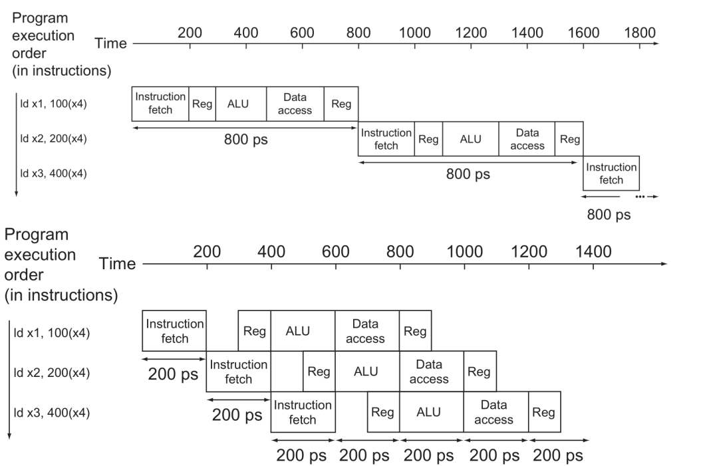
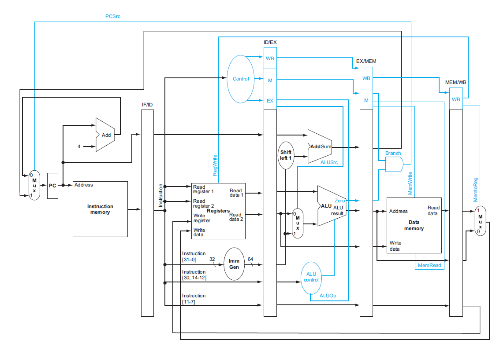

## CPU Performance Equation
---
CPU의 실행 시간을 결정하는 성능식은 다음과 같다.

$$CPU \ Time = IC \times CPI \times Cycle \ Time$$

* **IC (Instruction Count)**: 실행된 명령어의 총 개수이다.
* **CPI (Cycles Per Instruction)**: 명령어 하나가 완료되는데 걸리는 평균 사이클 수이다.
* **Cycle Time**: 클럭 주기로, 클럭 주파수의 역수이다.

### Edge-Triggered Clocking
현대 CPU는 에지 트리거 방식의 클러킹을 사용한다. 상태 소자에 저장된 값은 클럭 에지에서만 갱신된다. 이를 통해 설계를 단순화하고 데이터 일관성을 보장할 수 있다. 클럭 주기는 Critical Path에 의해 결정된다.

**Critical Path**: 전체 작업 시간을 결정하는 가장 오래 걸리는 작업의 경로. 한 클럭 에지부터 다음 클럭 에지까지 레지스터 Clk-to-Q 지연, 조합 논리 지연, 레지스터 Setup Time을 모두 포함한다.

## Pipeline
---
단일 사이클 설계는 명령어 하나를 한 사이클 안에 완료하므로 CPI가 1이지만 클럭 주기가 너무 길다. 이 시간을 줄이기 위해 파이프라인을 사용한다. 하나의 명령어를 여러 단계로 분할하여, 각 단계가 독립적으로 실행되는 구조를 만든다. RISC-V에서는 전통적으로 다음과 같은 5단계로 나뉜다.

1. **IF (Instruction Fetch)**: L1 I-Cache에서 명령어를 가져온다.
2. **ID (Instruction Decode)**: 명령어를 디코딩하고 레지스터 파일에서 피연산자를 읽는다.
3. **EX (Execute)**: ALU를 사용하여 연산을 수행한다.
4. **MEM (Memory Access)**: L1 D-Cache에 접근한다.
5. **WB (Write Back)**: 결과를 레지스터 파일에 기록한다.

### Pipeline Performance Analysis

_Single-cycle vs. Pipelined Execution_

파이프라인의 클럭 주기는 5개 단계 중 가장 긴 단계의 실행 시간에 의해 결정된다. 이론적으로 5단계 파이프라인은 단일 사이클 설계 대비 5배의 성능 향상을 제공해야 하지만, 실제로는 다음과 같은 이유로 이상적인 성능에 도달하지 못한다.

* **Unbalanced Stage Division**: 각 단계의 작업량을 완전히 균등하게 나눌 수 없어, 가장 긴 단계가 전체 클럭 속도를 제한한다.
* **Pipeline Register Overhead**: 단계 간 데이터를 전달하는 파이프라인 레지스터의 setup/hold time이 추가 지연을 발생시킨다.

파이프라인의 이점은 개별 명령어의 latency를 줄이는 것이 아니라, throughput을 증가시키는 것이다. 파이프라인이 완전히 채워지면 매 사이클마다 하나의 명령어가 완료되므로, CPI는 여전히 1을 유지한다. 그러나 클럭 주파수가 약 5배 증가하여 전체적인 성능이 향상된다.

총 $N$개의 명령어를 실행할 때, 단일 사이클 설계 대비 파이프라인의 성능 향상 비율은 다음과 같다.

$$Speedup = \frac{5N}{5 + (N - 1)}$$

* 분자 $5N$: 단일 사이클 설계에서 $N$개 명령어를 실행하는데 필요한 총 사이클 수
* 분모 $5 + (N-1)$: 파이프라인에서 첫 명령어가 완료되는데 5 사이클, 이후 각 명령어마다 1 사이클씩 추가

명령어 개수가 적을 때는 파이프라인을 채우는 초기 오버헤드(5 사이클)의 비중이 커서 성능 향상이 제한적이다. 예를 들어 $N=10$일 때 speedup은 약 3.6배에 불과하다. 반면 $N$이 충분히 클 때는 초기 오버헤드의 영향이 무시할 수 있을 정도로 작아져, speedup이 거의 5배에 가까워진다.

## Pipeline Datapath
---

_Pipeline Datapath_

각 단계 사이에는 파이프라인 레지스터가 존재하여 이전 단계의 결과를 다음 단계에 전달한다. 이를 통해 각 단계는 독립적으로 동시에 실행될 수 있다.

### Pipeline Registers
각 단계 경계에 위치한 파이프라인 레지스터와 저장되는 정보는 다음과 같다.

* **IF/ID**: PC, PC+4, 명령어
* **ID/EX**: PC, PC+4, 읽은 레지스터 값(rs1, rs2), 부호 확장 즉시값, Rs1/Rs2/Rd, 제어 신호, funct3/funct7
* **EX/MEM**: PC, 분기 주소, ALU 결과, Zero 플래그, Rs2 값(store용), Rd, 제어 신호
* **MEM/WB**: ALU 결과, 메모리 읽기 데이터, Rd, 제어 신호

### Control Signals
제어 신호는 MUX(Multiplexer)를 제어한다. MUX는 여러 입력 중 하나를 선택하여 출력으로 전달하는 회로로, 제어 신호에 따라 어떤 데이터 경로를 활성화할지 결정한다.

메인 제어 유닛이 생성하는 각 제어 신호와 그 역할은 다음과 같다.

| Signal | Role |
|--------|------|
| **RegWrite** | • 1: 레지스터 파일에 쓰기 수행 (R-type, load, JAL, JALR)<br>• 0: 쓰기 수행하지 않음 (store, branch) |
| **MemRead** | • 1: 메모리에서 읽기 수행 (load)<br>• 0: 읽기 수행하지 않음 |
| **MemWrite** | • 1: 메모리에 쓰기 수행 (store)<br>• 0: 쓰기 수행하지 않음 |
| **MemToReg** | • 1: 메모리 읽은 값을 레지스터로 전달 (load)<br>• 0: ALU 결과를 레지스터로 전달 |
| **ALUSrc** | • 1: ALU의 두 번째 입력이 즉시값 (I-type, S-type)<br>• 0: ALU의 두 번째 입력이 레지스터 값 (R-type, B-type) |
| **ALUOp** | ALU가 수행할 연산의 범주를 나타낸다. |
| **Branch** | • 1: 분기 명령어 (B-type)<br>• 0: 분기가 아닌 명령어 |
| **PCSrc** | • 1: 다음 PC를 분기 목적지로 갱신<br>• 0: 다음 PC를 PC+4로 갱신 |

PCSrc는 메인 제어 유닛이 직접 생성하는 신호가 아니라, Branch 신호와 ALU의 Zero 플래그를 AND 게이트로 결합하여 생성되는 파생 신호이다.

#### ALUOp Encoding

ALUOp 신호는 opcode에 따라 결정되며, 명령어 타입에 따라 ALU가 수행할 연산의 범주를 나타낸다.

| opcode | Instruction Type | ALUOp |
|--------|-----------------|-------|
| 0110011 | R-type | 10 |
| 0000011 | lw | 00 |
| 0100011 | sw | 00 |
| 1100011 | beq | 01 |

#### ALU Control Input

ALU 제어 유닛은 ALUOp와 funct3/funct7 필드를 조합하여 ALU 제어 입력을 생성한다.

| ALUOp | funct7 | funct3 | ALU Control | Operation |
|-------|--------|--------|-------------|-----------|
| 00 | X | X | 0010 | ADD (load/store) |
| 01 | X | X | 0110 | SUB (branch)|
| 10 | 0000000 | 000 | 0010 | ADD |
| 10 | 0100000 | 000 | 0110 | SUB |
| 10 | 0000000 | 111 | 0000 | AND |
| 10 | 0000000 | 110 | 0001 | OR |
| 10 | 0000000 | 010 | 0111 | SLT |


### Each Stage in Detail

#### 1. IF (Instruction Fetch)
PC를 사용하여 L1 I-Cache에서 명령어를 읽고 PC+4를 계산한다.

#### 2. ID (Instruction Decode)
IF/ID 레지스터에서 명령어를 받아 디코딩한다. 메인 제어 유닛이 opcode를 분석해 제어 신호들을 생성한다. ALUOp 신호는 ALU 제어 유닛으로 전달되어 funct3/funct7과 결합해 최종 ALU 제어 입력을 만든다. 레지스터 파일에서 rs1, rs2 피연산자를 읽고, 즉시값 생성기가 명령어 형식에 따라 분산된 즉시값 필드를 재조립 및 부호 확장한다.

#### 3. EX (Execute)
ALUSrc 신호에 따라 두 번째 피연산자로 레지스터 값 혹은 즉시값을 선택한다. ALU가 명령어 종류에 따라 연산을 수행한다. R-type은 두 레지스터 값 간의 연산을, I-type과 S-type은 레지스터 값과 즉시값 간의 연산을 수행한다. B-type은 두 레지스터 값을 비교해 분기 여부를 결정하고, 오프셋을 왼쪽으로 한 칸 시프트한 후 별도 덧셈기가 PC값과 더해 분기 목적지 주소를 계산한다.

#### 4. MEM (Memory Access)
ALU에서 계산된 주소로 L1 D-Cache에 접근한다. Load는 메모리에서 데이터를 읽어 MEM/WB 레지스터에 저장하고, store는 EX/MEM 레지스터에 저장된 rs2 값을 메모리에 쓴다. 메모리 접근이 필요 없는 명령어는 ALU 결과를 그대로 다음 단계로 넘긴다.

#### 5. WB (Write Back)
결과를 레지스터 파일에 기록한다. MemToReg 신호에 따라 메모리 데이터와 ALU 결과 중 하나를 선택한다. RegWrite 신호가 활성화된 경우에만 레지스터에 쓰기가 수행되며, x0는 항상 0으로 고정되어 쓰기가 무시된다.


## Pipeline Hazards
---
파이프라인에서 다음 명령어가 바로 다음 사이클에 실행될 수 없는 상황을 해저드라고 한다. 해저드를 처리하는 두 가지 기본 메커니즘은 다음과 같다.

**Stall**: 파이프라인의 진행을 일시적으로 멈추는 방식이다. 제어 신호를 통해 파이프라인 레지스터의 갱신을 막아 현재 진행 중인 단계들을 그 자리에 머물게 하고, 다음 단계에는 NOP(No Operation)을 삽입한다. 결과적으로 해당 명령어는 한 사이클 지연되어 마치 이 NOP 다음 명령어였던 것처럼 처리된다.

**Flush**: 파이프라인 레지스터에 NOP을 삽입하는 방식이다. NOP은 모든 제어 신호를 0으로 설정하여 구현되므로, 명령어가 남은 단계들을 진행하는 동안 레지스터 파일이나 메모리에 어떤 변경도 가하지 않는다.

해저드는 발생 원인에 따라 다음 세 가지로 분류된다.

### 1. Structural Hazard
한 사이클에 동시에 실행되려는 명령어들이 같은 하드웨어 자원을 필요로한다는 것을 의미한다. 예를 들어 L1 캐시가 통합 캐시라면, IF 단계의 명령어 읽기와 MEM 단계의 데이터 읽기가 동시에 일어날 수 없다. 현대 CPU는 Harvard 구조를 채택하여 L1을 I-Cache와 D-Cache로 분리함으로써 이 문제를 해결한다.

### 2. Data Hazard
명령어를 실행하는데 필요한 데이터가 아직 준비되지 않아 지연되는 경우이다. 다음 예를 본다.

```asm
add x19, x0, x1   # x19에 결과를 쓴다
sub x2, x19, x3   # x19 값을 읽는다
```

add 명령어는 WB 단계(5단계)까지 x19 값을 쓰지 않는데, sub 명령어는 ID 단계(2단계)에서 x19 값을 읽어야 한다. 이를 그대로 두면 sub 명령어가 오래된 값을 읽게 된다.

#### Forwarding
이 문제를 해결하기 위해 Forwarding Unit을 사용한다. ID/EX 파이프라인 레지스터에 오래된 값이 저장되더라도 그대로 진행하고, EX 단계를 시작하는 시점에 Forwarding Unit이 ForwardA, ForwardB 신호를 통해 ALU 입력을 제어한다. 이를 통해 ALU는 ID/EX 레지스터의 값 대신 이전 명령어의 최신 결과를 직접 받아 사용할 수 있으며, stall 없이 올바른 값으로 연산을 수행한다.

Forwarding Unit은 다음 두 경우를 감지한다.

**EX Hazard Detection:**
```
if (EX/MEM.RegWrite == 1 and EX/MEM.Rd != 0 and EX/MEM.Rd == ID/EX.Rs1)
    ForwardA = 10
if (EX/MEM.RegWrite == 1 and EX/MEM.Rd != 0 and EX/MEM.Rd == ID/EX.Rs2)
    ForwardB = 10
```

**MEM Hazard Detection:**
```
if (MEM/WB.RegWrite == 1 and MEM/WB.Rd != 0 and MEM/WB.Rd == ID/EX.Rs1
    and not (EX/MEM.RegWrite == 1 and EX/MEM.Rd != 0 and EX/MEM.Rd == ID/EX.Rs1))
    ForwardA = 01
if (MEM/WB.RegWrite == 1 and MEM/WB.Rd != 0 and MEM/WB.Rd == ID/EX.Rs2
    and not (EX/MEM.RegWrite == 1 and EX/MEM.Rd != 0 and EX/MEM.Rd == ID/EX.Rs2))
    ForwardB = 01
```

EX Hazard와 MEM Hazard가 동시에 발생하면 EX Hazard를 우선한다. EX/MEM 레지스터의 값이 더 최신이기 때문이다.

#### Load-Use Data Hazard
그러나 이전 명령어가 add가 아닌 load 명령어라면 Forwarding만으로는 해결되지 않는다.

```asm
lw  x19, 0(x1)    # MEM 단계에서 값을 읽는다
sub x2, x19, x3   # EX 단계에서 x19가 필요하지만 아직 준비되지 않음
```

sub 명령어가 EX 단계를 시작하는 시점에, lw 명령어는 MEM 단계를 시작하는 시점이다. 즉, lw는 이제 막 메모리 읽기를 시작하려는 상태이므로 x19의 값이 아직 준비되지 않았다. Forwarding은 이미 계산된 결과를 전달하는 것이므로, 아직 읽지 않은 메모리 데이터는 전달할 수 없다. 따라서 한 사이클의 지연이 반드시 발생한다.

이러한 load-use hazard가 감지되면 Hazard Detection Unit이 제어 신호를 통해 파이프라인을 한 사이클 stall시킨다. 구체적으로는 IF/IDWrite 신호를 0으로 설정하여 IF/ID 레지스터의 갱신을 막고, PCWrite 신호를 0으로 설정하여 PC 갱신을 막는다. 이를 통해 같은 명령어를 다시 fetch하게 된다. 동시에 ControlMux 신호를 1로 설정하여 ID/EX 레지스터로 전달되는 모든 제어 신호를 0으로 만들어 NOP을 삽입한다. 이러한 감지와 제어는 모두 ID 단계에서 이루어진다.

**Load-Use Hazard Detection:**
```
if (ID/EX.MemRead == 1 and (ID/EX.Rd == IF/ID.Rs1 or ID/EX.Rd == IF/ID.Rs2))
    stall pipeline
```

이러한 stall은 컴파일러가 의존성 없는 다른 명령어를 사이에 삽입하여 해결할 수도 있다.

#### Register File Half-Cycle Trick
레지스터에 동시에 읽고 쓰는 경우는 하드웨어 설계로 해결한다. 쓰기는 사이클의 앞부분에서, 읽기는 사이클의 뒷부분에서 일어나도록 하면, 같은 사이클에 쓰고 읽더라도 항상 새로 써진 값을 읽게 된다.

### 3. Control Hazard
분기 해저드라고도 불린다. 파이프라인은 매 사이클마다 새로운 명령어를 fetch해야 한다. 그런데 현재 실행 중인 명령어가 분기 명령어라면, 이미 fetch한 다음 명령어가 실제로 실행되어야 할 명령어가 아닐 수 있다. 분기의 결과가 확정될 때까지 올바른 명령어를 가져올 수 없으므로 해저드가 발생한다.

분기 결정이 MEM 단계(4단계)에서 이루어지므로, 그 사이에 fetch된 3개의 명령어를 flush해야 한다. 이는 파이프라인에 3사이클의 페널티를 발생시켜 성능 손실을 야기한다.

이 문제를 해결하기 위해 두 가지 기법을 사용한다.

#### Branch Prediction
분기 결과를 미리 추측하여 파이프라인을 진행시킨다. 예측이 맞으면 파이프라인을 그대로 진행시키고, 틀리면 잘못 fetch한 명령어들을 모두 flush하고 올바른 분기 주소로부터 다시 시작한다.

#### Early Branch Resolution
분기 결정을 MEM 단계가 아닌 ID 단계(2단계)로 앞당긴다. 덧셈기를 옮겨 ID 단계에서 분기 목적지 주소를 계산하고, 별도의 비교기를 추가하여 분기 조건을 판단한다. 이렇게 하면 예측 실패 시 flush해야 할 명령어가 1개로 줄어든다.

구체적으로 ID 단계에서는 다음 작업들이 수행된다.
- 분기 목적지 주소를 계산한다.
- 별도의 비교기를 통해 분기 조건을 판단한다.
- Zero 플래그와 Branch 신호를 AND 게이트를 통해 결합하여 PCSrc 제어 신호를 결정한다.
- 분기가 taken되면 올바른 PC 값을 피드백 루프를 통해 IF 단계로 전달한다.
- IF.Flush 신호를 활성화하여 IF/ID 레지스터를 flush한다.

이 기법을 위해서는 추가적인 하드웨어 지원이 필요하다.

**Forwarding Unit Extension**: 분기 명령어의 피연산자가 이전 명령어의 결과에 의존할 경우, EX/MEM 또는 MEM/WB 레지스터로부터 전방전달을 받을 수 있도록 ID 단계까지 지원을 확장한다.

**Hazard Detection Unit Extension**: ID 단계에서의 데이터 의존성을 감지하여 스톨한다. 일반적인 데이터 의존성은 1사이클, load-use hazard는 2사이클의 스톨이 필요하다.

분기 명령어 바로 직전 명령어가 피연산자를 생성하는 경우 추가적인 스톨이 발생하지만, 이러한 immediately preceding 의존성은 제한적이다. 반면 분기 taken과 예측 실패는 매우 빈번하므로, 분기 페널티를 2사이클 줄이는 것이 전체적으로 성능 향상을 가져온다.

### Hazard Control Signals
forwarding, stall, branch handling 로직을 구현하기 위해 다음과 같은 제어 신호들이 추가로 필요하다.

| Signal | Generated by | Role |
|--------|--------------|------|
| **ForwardA** | Forwarding Unit | EX 단계의 ALU 첫 번째 입력(rs1)에 공급할 값을 선택한다.<br>• 00: ID/EX 레지스터의 값 (레지스터 파일에서 읽은 값)<br>• 10: EX/MEM 레지스터의 ALU 결과<br>• 01: MEM/WB 레지스터의 값 |
| **ForwardB** | Forwarding Unit | EX 단계의 ALU 두 번째 입력(rs2)에 공급할 값을 선택한다.<br>• 00: ID/EX 레지스터의 값 (레지스터 파일에서 읽은 값)<br>• 10: EX/MEM 레지스터의 ALU 결과<br>• 01: MEM/WB 레지스터의 값 |
| **PCWrite** | Hazard Detection Unit | load-use hazard 감지 시 0으로 세팅되어 PC 레지스터의 갱신을 막는다. |
| **IF/IDWrite** | Hazard Detection Unit | load-use hazard 감지 시 0으로 세팅되어 IF/ID 파이프라인 레지스터의 갱신을 막는다. |
| **ControlMux** | Hazard Detection Unit | load-use hazard 감지 시 1로 세팅되어 ID/EX 레지스터로 전달되는<br>제어 신호들을 모두 0으로 만들어 NOP을 삽입한다. |
| **IF.Flush** | Branch Control | 분기 결정 시 잘못 fetch한 명령어를 무효화하기 위해 IF/ID 레지스터를 flush한다. |


## Branch Prediction
---
분기 예측은 분기 명령어의 결과를 실제 실행 전에 추측하여 파이프라인 낭비를 줄이는 기법이다. 예측 방식은 크게 정적 예측과 동적 예측으로 나뉘며, 현대 CPU는 동적 예측을 주로 사용한다.

### Static Prediction
프로그램의 실행 패턴을 학습하지 않고, 고정된 규칙에 따라 예측한다. 가장 간단한 방법은 항상 분기하지 않는다고 가정하는 것이다. 혹은 루프처럼 뒤로 점프하는 분기는 분기할 것이라고, 앞으로 점프하는 분기는 분기하지 않을 것이라고 가정하는 방법도 있다. 이는 특정 분기 명령어의 개별적인 특성을 고려하지 않고, 보편적인 행동 패턴에만 의존한다.

### Dynamic Prediction
프로그램의 실제 분기 패턴을 기록하여 통계적으로 예측한다. 핵심 자료구조는 분기 히스토리 테이블로, PC의 일부 비트를 인덱스로 사용한다.

#### 1-Bit Predictor
분기했으면 다음에도 분기할 것이라고, 안 했으면 안 할 것이라고 예측한다. 그러나 루프 끝에서 문제가 발생한다. 루프를 10번 반복하면 마지막 반복에서 루프를 빠져나갈 때와 다음 루프 첫 반복에서 다시 루프로 돌아올 때, 총 2번 예측이 틀린다.

#### 2-Bit Predictor
1-Bit의 문제를 해결하기 위해 4가지 상태를 사용한다.

* **00 - Strongly Not Taken**: 분기하지 않는다고 강하게 확신
* **01 - Weakly Not Taken**: 분기하지 않는다고 약하게 확신
* **10 - Weakly Taken**: 분기한다고 약하게 확신
* **11 - Strongly Taken**: 분기한다고 강하게 확신

실제로 분기하면 상태를 1 증가, 안 하면 1 감소시킨다. 루프 10회 반복의 경우, 마지막 반복(11→10)에서 아직 Weakly Taken이므로 분기한다고 예측하여 다음 루프 첫 반복에서 예측 실패가 발생하지 않는다. 1번만 틀린다.

#### Branch Target Buffer (BTB)
분기 히스토리 테이블은 분기할지 안 할지는 알려준다. 그러나 실제 분기 목적지 주소를 계산하는데는 1사이클이 걸린다. 이 손실을 없애기 위해 BTB를 사용한다. BTB는 PC 값과 그에 대응하는 목적지 명령어 주소를 저장하는 캐시로, 분기 명령어를 fetch하는 순간 목적지를 즉시 제공한다.

#### Correlated Predictor
특정 분기 명령어의 결과는 그 앞에 있었던 다른 분기들의 결과에 따라 패턴이 달라진다는 것이 발견되었다. 기존 인덱스에 직전 분기의 결과(took/not-took)를 추가 비트로 붙여서, 패턴별로 히스토리 테이블을 구성한다. 이를 통해 단일 분기의 과거만 본다는 한계를 벗어나 분기 간의 상관관계를 활용할 수 있다.

#### Tournament Predictor
여러 예측기를 동시에 운영하고 분기마다 가장 적합한 예측기를 선택한다. 대표적으로 로컬 예측기와 글로벌 예측기를 함께 사용한다.

* **Local Predictor**: 각 분기의 개별 히스토리를 기록한다 (e.g., 2-bit predictor).
* **Global Predictor**: 최근 실행된 모든 분기들의 결과를 기록하여 분기 간 상관관계를 활용한다(Correlated Predictor).
* **Meta-Predictor**: 각 분기에 대해 어떤 예측기를 신뢰할지 결정한다. 분기 실행 후 어떤 예측기가 옳았는지 확인하여 상태를 갱신한다.

이러한 동적 분기 예측기는 현대 CPU에서 90% 이상의 정확도를 달성한다.


## Exception Handling
---
예외가 발생하면 예외를 일으킨 명령어 이후의 모든 명령어를 flush하고, 예외 핸들러로 제어를 이전한다. 예외가 발생한 명령어의 PC는 EPC(Exception Program Counter) 레지스터에 저장되어, 예외 처리 후 해당 명령어부터 다시 실행할 수 있도록 한다.

### Exception Control Signals

예외 처리를 위해 다음과 같은 제어 신호들이 추가로 필요하다.

| Signal | Role |
|--------|------|
| **ID.Flush** | 잘못된 명령어를 무효화하기 위해 ID/EX 레지스터를 flush한다. |
| **EX.Flush** | 잘못된 연산의 결과가 레지스터에 쓰이는 것을 막기 위해 EX/MEM 레지스터를 flush한다. |
| **Trap** | PC MUX가 분기 결정이나 순차 실행을 무시하고, 예외 핸들러 주소를 선택하도록 강제한다. |

### Exception Types

예외의 원인을 CPU에 전달하는 방식은 두 가지로 나뉜다.

* **Cause Register**: 예외 원인을 직접 레지스터 값으로 저장하는 방식이다. OS가 이 레지스터를 읽어 예외 종류를 판단한다.
* **Interrupt Vector**: 예외 종류마다 별도의 핸들러 주소가 정해져 있어, 해당 벡터 주소로 직접 점프하는 방식이다.


## Instruction-Level Parallelism (ILP)
---
ILP는 프로그램 내에서 동시에 실행될 수 있는 명령어들이 얼마나 많은지를 나타내는 개념이다. 파이프라인은 ILP를 활용하는 기본적인 방법이지만, 한 사이클에 하나의 명령어만 내보낸다. 성능을 더욱 향상시키기 위해 한 사이클에 여러 명령어를 동시에 내보내는 기법을 사용한다.

### IPC (Instructions Per Cycle)
CPI의 역수로, 한 사이클당 완료되는 명령어의 개수를 나타낸다. 기본 파이프라인의 이상적인 CPI가 1이므로 IPC도 1이다. Multiple issue 기법을 사용하면 IPC를 1보다 크게 만들 수 있다.

$$IPC = \frac{1}{CPI}$$

Multiple issue 프로세서는 CPI < 1, 즉 IPC > 1을 달성한다. 예를 들어 한 사이클에 4개의 명령어를 내보낼 수 있다면 이상적인 IPC는 4가 된다.

### Multiple Issue
한 사이클에 여러 명령어를 동시에 실행하기 위해서는 여러 개의 명령어를 동시에 fetch, decode, execute할 수 있는 하드웨어가 필요하다. Multiple issue는 명령어를 내보내는 방식에 따라 정적 내보내기와 동적 내보내기로 나뉜다.


## Static Multiple Issue
---
컴파일러가 컴파일 시점에 동시에 실행될 수 있는 명령어들을 결정하고 묶어주는 방식이다. 프로세서는 이미 묶여진 명령어 패킷을 받아 실행하기만 하면 된다.

### Issue Packet
컴파일러가 생성하는 명령어 묶음으로, 한 사이클에 동시에 내보낼 수 있는 명령어들의 집합이다. 일반적으로 issue packet은 고정된 형식을 가지며, 각 슬롯은 특정 종류의 명령어(ALU 연산, load/store, 분기 등)를 위해 예약된다.

예를 들어 2-issue RISC-V 프로세서의 issue packet 구조는 다음과 같을 수 있다.

| ALU/Branch | Load/Store |
|------------|------------|
| ALU 연산 또는 분기 명령어 | Load 또는 store 명령어 |

### VLIW (Very Long Instruction Word)
정적 다중 내보내기의 대표적인 구조이다. 여러 개의 연산을 하나의 긴 명령어로 묶어서 표현한다. 컴파일러가 명령어 스케줄링과 해저드 회피를 모두 담당하므로 하드웨어가 단순해진다.

**Pros:**
* 하드웨어가 단순하고 전력 소모가 적다
* 컴파일러가 프로그램 전체를 분석하여 최적화할 수 있다

**Cons:**
* 컴파일 시점에 모든 것을 결정하므로 실행시간 정보를 활용할 수 없다
* 메모리 지연이나 캐시 미스 등 예측 불가능한 상황에 대응하기 어렵다
* 코드 크기가 증가한다 (빈 슬롯에도 NOP을 채워야 함)
* 바이너리 호환성이 떨어진다 (issue width가 다른 프로세서에서 재컴파일 필요)

### Loop Unrolling
정적 다중 내보내기의 효율을 높이기 위해 컴파일러가 사용하는 최적화 기법이다. 루프를 여러 번 펼쳐서 반복 오버헤드를 줄이고, 더 많은 독립적인 명령어를 생성하여 동시 실행 가능성을 높인다.

```c
// 원본 루프
for (i = 0; i < 100; i++) {
    x[i] = x[i] + s;
}

// Unrolled 루프 (4배)
for (i = 0; i < 100; i += 4) {
    x[i]   = x[i]   + s;
    x[i+1] = x[i+1] + s;
    x[i+2] = x[i+2] + s;
    x[i+3] = x[i+3] + s;
}
```

Unrolling 후에는 4개의 독립적인 load와 store가 생성되어 여러 issue slot을 동시에 채울 수 있다.


## Dynamic Multiple Issue (Superscalar)
---
프로세서가 실행 시점에 동적으로 동시 실행 가능한 명령어들을 찾아 내보내는 방식이다. 동적 다중 내보내기를 구현한 프로세서를 Superscalar 프로세서라 하며, 현대 고성능 프로세서의 표준 구조이다. 하드웨어가 런타임에 ILP를 추출하므로, ISA가 같은 다른 프로세서에서도 재컴파일 없이 실행 가능하다.

### Dynamic Scheduling
명령어의 실행 순서를 동적으로 재배치하는 핵심 기법이다. 명령어를 프로그램 순서대로 fetch하지만, 실행은 의존성에 따라 순서를 바꿔서 수행한다(out-of-order execution). 앞의 명령어가 메모리 접근으로 지연되더라도, 독립적인 뒤의 명령어들을 먼저 실행하여 파이프라인 stall을 최소화한다. 

하드웨어는 실행 시점의 상황(캐시 히트/미스, 분기 결과, 데이터 의존성 등)을 감지하여 명령어 실행 순서와 자원 할당을 실시간으로 조정한다. 이를 위해 다음과 같은 하드웨어 구조가 필요하다.

**Reservation Station**: 각 실행 유닛 앞에 위치하여 피연산자를 기다리는 버퍼이다. 피연산자가 준비되는 즉시 실행을 시작할 수 있다.

**Reorder Buffer (ROB)**: Out-of-order 실행된 명령어들을 원래 프로그램 순서대로 commit하기 위한 버퍼이다. 예외나 분기 예측 실패 시 정확한 상태 복구를 보장한다.

### Register Renaming
같은 레지스터 이름을 사용하지만 실제로는 독립적인 명령어들 사이의 false dependency를 제거하는 기법이다.

**Dependency Types:**
* **RAW (Read After Write)**: true dependency, 앞 명령어가 쓴 값을 뒤 명령어가 읽음
* **WAR (Write After Read)**: anti-dependency, 레지스터 이름만 겹치는 거짓 의존성
* **WAW (Write After Write)**: output dependency, 같은 레지스터에 쓰는 거짓 의존성

```asm
add x1, x2, x3     # x1에 쓰기
sub x4, x1, x5     # x1 읽기 (RAW - 진짜 의존성)
mul x1, x6, x7     # x1에 쓰기 (WAW - 거짓 의존성)
```

Register renaming은 물리적 레지스터를 논리적 레지스터보다 많이 두고, 각 쓰기마다 새로운 물리적 레지스터를 할당한다. 이를 통해 WAR과 WAW 의존성을 제거하여 더 많은 명령어를 동시에 실행할 수 있다.

### Speculation
실행 결과가 확정되지 않은 상태에서 예측을 기반으로 명령어를 실행하는 기법이다. 분기 예측과 결합하여 분기 뒤의 명령어들을 투기적 실행한다.

예측이 맞으면 이미 실행된 결과를 그대로 사용한다. 예측이 틀리면 투기적 실행된 명령어들의 결과를 모두 버리고 올바른 경로부터 다시 시작한다. Reorder Buffer가 투기적 실행된 명령어들을 commit하기 전까지 보관하여, 예측 실패 시 정확한 상태로 복구할 수 있게 한다.

### Limitations of Superscalar
Superscalar 프로세서는 다음과 같은 한계가 있다.

* **Limited ILP**: 일반적인 프로그램의 ILP는 생각보다 높지 않다. 의존성과 분기 때문에 평균 3-6개 정도의 명령어만 동시 실행 가능하다.
* **Complex Hardware**: Issue width가 증가할수록 의존성 검사와 스케줄링 로직이 복잡해진다.
* **Power Consumption**: 동적 스케줄링과 투기적 실행을 위한 하드웨어는 많은 전력을 소비한다.
* **Branch Prediction Dependency**: 예측이 틀리면 많은 명령어를 flush해야 하므로 분기 예측 정확도가 성능에 큰 영향을 준다.

이러한 한계 때문에 최신 프로세서들은 4-8 issue 정도에서 균형점을 찾고 있다.