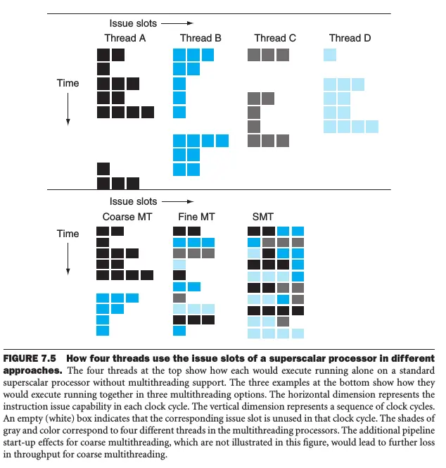

## Amdahl's Law
---
프로세서 개수를 늘린다고 해서 성능이 무한정 향상되지는 않는다. 병렬화가 불가능한 순차 처리 구간이 전체 성능의 상한선을 결정하기 때문이다.

### Speedup Formula
전체 작업 중 병렬화 가능한 비율을 $P$, 프로세서 개수를 $N$이라 하면 속도 향상은 다음과 같다.

$$\text{Speedup} = \frac{1}{(1 - P) + \frac{P}{N}}$$

* **(1 - P):** 병렬화 불가능한 순차 구간
* **P/N:** 병렬화 가능한 구간

### Example
프로세서 100개를 투입해서 90배의 속도 향상을 얻으려면 전체 코드의 몇 %를 병렬화해야 하는가?

$$90 = \frac{1}{(1 - P) + \frac{P}{100}}$$

분모를 정리하면 $(1 - P) + 0.01P = 1 - 0.99P$가 된다. $P$만큼의 시간이 $0.01P$로 줄었으므로 $0.99P$만큼 절약된 것이다.

$$90 \times (1 - 0.99P) = 1$$
$$90 - 89.1P = 1$$
$$P = \frac{89}{89.1} \approx 0.999$$

프로세서를 100개나 사용해도 90배 성능 향상을 얻으려면 전체 작업의 99.9%를 병렬화해야 한다. 단 0.1%의 순차 구간만으로도 목표 달성이 불가능하다.

## Scaling
---
암달의 법칙에 따르면 문제 크기가 고정되어 있을 때 프로세서만 늘리면 성능 향상에 한계가 온다. 순차 구간의 비중이 커지기 때문이다.

성능을 평가하는 두 가지 지표는 다음과 같다.

* **Speedup:** $\frac{T_{\text{original}}}{T_{\text{parallel}}}$
* **Efficiency:** $\frac{\text{Speedup}}{\text{Processors}}$

### Strong Scaling
전체 문제 크기는 고정하고 프로세서 개수만 늘리는 방식이다. 같은 문제를 얼마나 빨리 풀 수 있는가에 집중한다.

#### Example: 10x10 Matrix
10x10 행렬 덧셈을 수행한다고 가정한다.

* **Sequential work:** 10 
* **Parallel work:** 100
* **Total time:** $100 + 10 = 110$

**Case A: 프로세서 10개**

**Execution time:** $\frac{100}{10} + 10 = 20$

**Speedup:** $\frac{110}{20} = 5.5$배

**Efficiency:** $\frac{5.5}{10} = 0.55$ (55%)

**Case B: 프로세서 40개**

**Execution time:** $\frac{100}{40} + 10 = 12.5$

**Speedup:** $\frac{110}{12.5} = 8.8$배

**Efficiency:** $\frac{8.8}{40} = 0.22$ (22%)

프로세서를 4배 늘렸는데 속도는 겨우 1.6배 빨라졌다. 효율은 55%에서 22%로 떨어졌다.

### Weak Scaling
프로세서를 늘리는 만큼 문제 크기도 비례해서 키우는 방식이다. 같은 시간에 얼마나 많은 일을 처리할 수 있는가에 집중한다.

#### Example: 20x20 Matrix
이번에는 20x20 행렬 덧셈을 수행한다.

* **Sequential work:** 10
* **Parallel work:** 400
* **Total time:** $400 + 10 = 410$

**Case A: 프로세서 10개**

**Execution time:** $\frac{400}{10} + 10 = 50$

**Speedup:** $\frac{410}{50} = 8.2$배

**Efficiency:** $\frac{8.2}{10} = 0.82$ (82%)

**Case B: 프로세서 40개**

**Execution time:** $\frac{400}{40} + 10 = 20$

**Speedup:** $\frac{410}{20} = 20.5$배

**Efficiency:** $\frac{20.5}{40} = 0.51$ (51%)

작은 문제일 때는 프로세서 40개의 효율이 22%였지만, 큰 문제에서는 51%로 2배 이상 좋아졌다. 거대한 시스템을 제대로 활용하려면 문제 규모 자체를 키우는 Weak Scaling 방식으로 접근해야 한다.

## Load Balancing
---
병렬 처리 시스템의 전체 성능은 가장 늦게 끝나는 프로세서가 결정한다. 나머지 39개가 0.01초 만에 끝내도 단 1개가 1분 걸리면 전체 실행 시간은 1분이다.

### Baseline
20x20 행렬을 프로세서 40개로 처리하는 경우를 가정한다.
* **Total workload:** 410 (순차 10 + 병렬 400)
* **Ideal load per processor:** 2.5% ($100 \div 40$)
* **Ideal speedup:** 20.5x

### Load 2x
한 프로세서가 다른 프로세서보다 2배 더 일하게 되었을 때를 보자.

* **Bottleneck processor load:** 5% (이상적인 2.5%의 2배)
* **Parallel portion time:** $400 \times 0.05 = 20$
* **Total time:** $20 + 10 = 30$
* **Speedup:** $\frac{410}{30} \approx 13.7$x

이상적인 20.5배에서 13.7배로 떨어졌다. 부하가 2배 늘었을 뿐인데 전체 성능은 약 33% 하락했다.

### Load 5x
한 프로세서가 다른 프로세서보다 5배 더 일하게 되었을 때를 보자.

* **Bottleneck processor load:** 12.5% (이상적인 2.5%의 5배)
* **Parallel portion time:** $400 \times 0.125 = 50$
* **Total time:** $50 + 10 = 60$
* **Speedup:** $\frac{410}{60} \approx 6.8$x

이상적인 20.5배에서 6.8배로 떨어졌다. 부하가 5배 늘어나니 전체 성능은 거의 3배 가까이 느려졌다.

## SIMD (Single Instruction Multiple Data)
---
하나의 명령어로 여러 데이터를 동시에 처리하는 방식이다. 이를 DLP(Data-Level Parallelism)라 한다.

배열 형태로 데이터를 묶어서 메모리 주소를 전달하면, 프로세서 내부의 넓은 레지스터와 여러 개의 ALU가 동시에 연산을 수행한다. 같은 작업을 여러 데이터에 동시에 적용할 때 유용하다.

## Hardware Multithreading
---
하나의 프로세서 코어가 여러 스레드를 빠르게 전환하며 실행하는 기법이다. 메모리 스톨 같은 지연이 발생했을 때 다른 스레드를 실행시켜 처리량 손실을 줄인다. 이를 TLP(Thread-Level Parallelism)라 한다.

### Fine-Grained Multithreading
스레드당 명령어 하나를 실행하고 즉시 다음 스레드로 전환하는 방식이다.

* **Pros:** 스톨이 생겨도 즉시 다른 스레드가 실행되므로, 파이프라인 낭비를 최소화한다.
* **Cons:** 모든 스레드가 번갈아 실행되므로 개별 스레드의 완료 시간은 길어진다.

GPU에서 주로 사용한다. 픽셀 하나를 빨리 띄우는 것보다 전체 픽셀을 다 띄우는 처리량이 중요하기 때문이다.

### Coarse-Grained Multithreading
L3 캐시 미스 같은 긴 지연이 발생할 때만 스레드를 전환하는 방식이다.

* **Pros:** 지연이 발생하기 전까지는 스레드 전환을 하지 않으므로, 개별 스레드가 파이프라인을 독점하여 성능을 그대로 유지한다.
* **Cons:** 짧은 지연은 해결하지 못한다. 스레드를 전환할 때는 파이프라인을 비우고 다시 채워야 하므로 전환 비용이 크다.

### Simultaneous Multithreading (SMT)
슈퍼스칼라 프로세서의 멀티 이슈 슬롯을 최대로 활용하는 방식이다.

Coarse-grained는 개별 스레드의 속도는 유지했지만 짧은 지연을 해결하지 못했고 전환 비용이 컸다. Fine-grained는 지연은 숨겼지만 개별 스레드의 속도가 느렸다. 두 방식 모두 한 사이클에 한 스레드의 명령어만 발행할 수 있었다.

SMT는 이슈 슬롯이 비어 있으면 다른 스레드의 명령어도 가져와서 슬롯을 꽉 채운다. 따라서 ILP와 TLP를 동시에 최대로 활용할 수 있다.

_Multithreading Models Comparison: Coarse-Grained vs Fine-Grained vs SMT_

## NUMA (Non-Uniform Memory Access)
---
메모리는 하나인데 프로세서 개수만 계속 늘어나면 문제가 생긴다. 메모리 버스의 대역폭은 제한되어 있는데 모든 프로세서가 같은 버스를 공유하기 때문이다.

프로세서가 4개에서 8개, 16개로 늘어날수록 메모리 접근 경쟁이 심해지고 버스는 병목 지점이 된다. 결국 프로세서를 아무리 추가해도 메모리 대역폭 한계 때문에 성능 향상이 멈춘다.

### Distributed Memory Architecture
NUMA는 각 프로세서마다 전용 메모리를 배치하는 방식으로 이 문제를 해결한다. 프로세서는 자신의 로컬 메모리에 빠르게 접근할 수 있고, 다른 프로세서의 메모리에도 접근할 수 있지만 속도는 느리다.

* **Local access:** 자신의 메모리에 접근할 때는 빠르다.
* **Remote access:** 다른 프로세서의 메모리에 접근할 때는 느리다.

메모리 접근 시간이 균일하지 않기 때문에 Non-Uniform Memory Access라 부른다. 성능을 최대화하려면 스레드가 자신의 로컬 메모리를 주로 사용하도록 데이터를 배치해야 한다.

## Cluster
---
클러스터는 여러 개의 독립적인 컴퓨터를 네트워크로 연결해서 하나의 시스템처럼 동작하게 만드는 구조다. 각 노드는 자체 프로세서와 메모리를 가지고 있으며, 메시지 전달 방식으로 통신한다.

### Message Passing
클러스터의 각 노드는 메모리를 공유하지 않는다. 데이터를 주고받으려면 네트워크를 통해 명시적으로 메시지를 보내야 한다.

* **Pros:** 확장성이 뛰어나다. 노드를 추가하는 것만으로 시스템을 키울 수 있다.
* **Cons:** 통신 오버헤드가 크다. 네트워크 지연과 데이터 복사 비용이 발생한다.

독립적으로 처리 가능한 작업을 대량으로 분산시킬 때 유용하다.